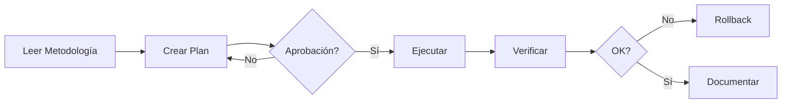

# ⚠️ INSTRUCCIONES OBLIGATORIAS PARA CLAUDE CODE - GRAPHITI PROJECT

## 🚨 LECTURA OBLIGATORIA EN CADA SESIÓN
Este archivo contiene las reglas críticas que DEBES seguir siempre.
La metodología completa está en `docs/DEVELOPMENT_METHODOLOGY.md`

---

## ⛔ REGLAS INQUEBRANTABLES

### 1. PRINCIPIO FUNDAMENTAL
**NUNCA pasar del plan a la acción sin aprobación explícita del usuario**

### 2. CHECKPOINTS OBLIGATORIOS - DETENER Y ESPERAR APROBACIÓN
- [ ] **FASE 0**: Setup inicial → STOP
- [ ] **FASE 1**: Análisis completado → STOP
- [ ] **FASE 2**: Plan detallado → STOP
- [ ] **FASE 3**: Diseño técnico → STOP
- [ ] **FASE 4**: Backup realizado → STOP
- [ ] **FASE 6**: PR listo → STOP
- [ ] **FASE 7**: Pre-release → STOP

### 3. ANTES DE CUALQUIER CAMBIO
```bash
# SIEMPRE ejecutar safety commit
git add -A
git commit -m "safety: pre-[action] snapshot"
git push origin $(git branch --show-current)
```

### 4. USO OBLIGATORIO DE HERRAMIENTAS
- ✅ **TodoWrite**: Para TODA tarea con >3 pasos
- ✅ **Git**: Commits atómicos cada componente funcional
- ✅ **Testing**: Ejecutar tests ANTES y DESPUÉS de cambios
- ✅ **Backup**: De configuraciones y datos críticos

---

## 📋 FLUJO DE TRABAJO ESTRICTO



---

## 📚 DOCUMENTACIÓN ESENCIAL

### Metodología Completa
- **📘 Proceso completo**: [`docs/DEVELOPMENT_METHODOLOGY.md`](docs/DEVELOPMENT_METHODOLOGY.md)
- **🛑 Checkpoints detallados**: [`docs/CHECKPOINTS.md`](docs/CHECKPOINTS.md)
- **📝 Templates**: [`docs/templates/`](docs/templates/)
- **🔧 Scripts validación**: [`.claude/`](.claude/)

### Documentación del Proyecto
- **🏗️ Arquitectura**: [`docs/claude_code/CLAUDE_CODE_COMPLETE.md`](docs/claude_code/CLAUDE_CODE_COMPLETE.md)
- **📊 Estado actual**: Branch `evaluation/embeddings-comparison`
- **🎯 Objetivo actual**: Módulo de backup programático

---

## 🛠️ COMANDOS DE VALIDACIÓN

### Verificar cumplimiento antes de proceder
```bash
# Verificar metodología
python .claude/check_methodology.py

# Validar antes de commit
.claude/pre-commit-validator.sh

# Verificar tests
pytest tests/ -v

# Verificar calidad de código
ruff check .
mypy graphiti_core/
```

---

## 🔴 CONDICIONES DE PARADA INMEDIATA

1. **Errores de API**: 401, 403, rate limits
2. **Tests fallando**: Cualquier test existente roto
3. **Import errors**: Dependencias faltantes
4. **Sin aprobación**: Usuario no ha confirmado proceder
5. **Regression detectada**: Funcionalidad existente afectada

---

## 💡 RECORDATORIOS CRÍTICOS

### En cada sesión DEBES:
1. ✅ Leer este archivo completo
2. ✅ Verificar branch actual: `git branch --show-current`
3. ✅ Verificar estado: `git status`
4. ✅ Revisar TodoWrite pendientes
5. ✅ Confirmar con usuario antes de cambios

### NUNCA debes:
1. ❌ Trabajar en `main` directamente
2. ❌ Hacer cambios sin backup previo
3. ❌ Proceder sin tests pasando
4. ❌ Ignorar checkpoints de aprobación
5. ❌ Commitear sin mensaje descriptivo

---

## 🎯 CONTEXTO ACTUAL DEL PROYECTO

### Tarea en Progreso
**Módulo de Backup Programático para Graphiti**
- Evitar consumo excesivo de tokens en operaciones de backup
- Implementar backup/restore programático
- Mantener compatibilidad con sistema existente

### Stack Tecnológico
- **Python 3.11+** con `uv`
- **Neo4j** (bolt://localhost:7687)
- **Testing**: pytest, pytest-asyncio
- **Quality**: ruff, mypy, black
- **CI/CD**: GitHub Actions

---

## 📞 SOPORTE Y ESCALACIÓN

Si encuentras problemas:
1. Documentar el error completo
2. Hacer rollback si es necesario
3. Consultar con el usuario antes de intentar fixes
4. No intentar soluciones no probadas en producción

---

**RECORDATORIO FINAL**: Este documento es tu contrato con el usuario. 
El incumplimiento de estas reglas es inaceptable.

---

*Última actualización: 2025-01-23*
*Versión: 1.0.0*