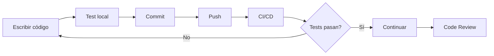

# 📋 METODOLOGÍA DE DESARROLLO PROFESIONAL - GRAPHITI PROJECT
## Version 2.0 - Pipeline Completo de Desarrollo

### 📅 Fecha de creación: 2025-01-23
### 👤 Autor: Team Graphiti Development
### 🏷️ Version: 2.0.0

---

## 🎯 PRINCIPIOS FUNDAMENTALES

### 1. Principio de Aprobación Explícita
**NUNCA pasar del plan a la acción sin aprobación explícita del usuario**

### 2. Principio de Desarrollo Iterativo
Cada fase debe ser completada, revisada y aprobada antes de continuar

### 3. Principio de Trazabilidad
Todo cambio debe ser documentado, versionado y reversible

### 4. Principio de Calidad
El código debe cumplir con métricas de calidad definidas antes de ser integrado

---

## 🔀 ESTRATEGIA DE GIT & GITHUB

### Flujo de Branches

```
main (producción estable)
  └── evaluation/embeddings-comparison (rama de desarrollo actual)
        └── feature/backup-module (nueva funcionalidad)
              └── feature/backup-module-tests (tests específicos)
```

### Nomenclatura de Branches
- `feature/*` - Nuevas funcionalidades
- `fix/*` - Corrección de bugs
- `hotfix/*` - Correcciones urgentes en producción
- `docs/*` - Actualización de documentación
- `test/*` - Añadir o modificar tests
- `refactor/*` - Refactorización de código

### Estrategia de Merge
- **Feature branches**: Squash and merge
- **Hotfixes**: Rebase and merge
- **Release branches**: Merge commit

---

## 📊 FASES DEL PIPELINE DE DESARROLLO

### FASE 0: SETUP INICIAL 🛠️

#### 0.1 Verificación del Entorno
```bash
# Verificar estado actual del repositorio
git status
git branch --show-current
git log --oneline -5

# Verificar remotes
git remote -v

# Sincronizar con upstream
git fetch origin
git pull origin evaluation/embeddings-comparison
```

#### 0.2 Creación de Feature Branch
```bash
# Crear y cambiar a nueva branch
git checkout -b feature/backup-module

# Configurar upstream tracking
git push -u origin feature/backup-module
```

#### 0.3 Configuración de Herramientas

**Pre-commit hooks (.pre-commit-config.yaml)**
```yaml
repos:
  - repo: https://github.com/astral-sh/ruff-pre-commit
    rev: v0.1.0
    hooks:
      - id: ruff
        args: [--fix]
  - repo: https://github.com/psf/black
    rev: 23.11.0
    hooks:
      - id: black
        language_version: python3.11
  - repo: https://github.com/pre-commit/mirrors-mypy
    rev: v1.7.0
    hooks:
      - id: mypy
        additional_dependencies: [types-all]
```

**Instalación**
```bash
pip install pre-commit
pre-commit install
pre-commit run --all-files
```

#### 0.4 **Checkpoint** 🛑
- [ ] Entorno configurado correctamente
- [ ] Branch creada y tracking configurado
- [ ] Herramientas instaladas
- **Requiere aprobación para continuar**

---

### FASE 1: ANÁLISIS Y DOCUMENTACIÓN 📚

#### 1.1 Análisis del Código Existente
- Revisar arquitectura actual
- Identificar patrones de diseño utilizados
- Documentar dependencias
- Analizar posibles conflictos

#### 1.2 Documentación de Hallazgos
```markdown
## Análisis de Código Base
### Arquitectura Actual
- [Descripción]

### Patrones Identificados
- [Pattern 1]
- [Pattern 2]

### Dependencias
- [Dep 1]: versión, uso
- [Dep 2]: versión, uso

### Riesgos Identificados
- [Riesgo 1]: impacto, mitigación
```

#### 1.3 **Checkpoint** 🛑
- [ ] Análisis completo documentado
- [ ] Riesgos identificados
- **Requiere aprobación para continuar**

---

### FASE 2: PLANIFICACIÓN DETALLADA 📝

#### 2.1 Plan de Desarrollo
```markdown
## Plan de Implementación
### Objetivo
[Descripción clara del objetivo]

### Alcance
- Incluido: [lista]
- Excluido: [lista]

### Timeline
- Fase 1: [duración estimada]
- Fase 2: [duración estimada]

### Recursos Necesarios
- [Recurso 1]
- [Recurso 2]
```

#### 2.2 Criterios de Aceptación
```markdown
## Criterios de Aceptación
### Funcionales
- [ ] Criterio 1
- [ ] Criterio 2

### No Funcionales
- [ ] Performance: [métrica]
- [ ] Seguridad: [requisito]
- [ ] Escalabilidad: [requisito]

### Testing
- [ ] Unit tests: >80% coverage
- [ ] Integration tests: todos pasan
- [ ] E2E tests: escenarios críticos
```

#### 2.3 Plan de Commits
```markdown
## Estrategia de Commits
### Formato
type(scope): description

### Tipos permitidos
- feat: nueva funcionalidad
- fix: corrección de bug
- docs: documentación
- style: formato (no afecta lógica)
- refactor: refactorización
- test: añadir tests
- chore: tareas de mantenimiento

### Ejemplos
feat(backup): implement backup manager class
fix(restore): handle empty backup files
docs(backup): add API documentation
test(backup): add unit tests for manager
```

#### 2.4 **Checkpoint** 🛑
- [ ] Plan completo y detallado
- [ ] Criterios de aceptación definidos
- [ ] Timeline realista
- **Requiere aprobación para continuar**

---

### FASE 3: DISEÑO TÉCNICO 🏗️

#### 3.1 Arquitectura de la Solución
```markdown
## Diseño Técnico
### Arquitectura
[Diagrama o descripción]

### Componentes
1. Component A
   - Responsabilidad:
   - Interfaces:
   - Dependencias:

2. Component B
   - Responsabilidad:
   - Interfaces:
   - Dependencias:
```

#### 3.2 Estructura de Archivos
```
graphiti_core/
└── utils/
    └── backup/
        ├── __init__.py
        ├── backup_manager.py      # Core backup logic
        ├── restore_manager.py     # Restore functionality
        ├── schemas.py            # Data models
        ├── validators.py         # Input validation
        ├── utils.py             # Helper functions
        └── tests/
            ├── __init__.py
            ├── test_backup.py
            ├── test_restore.py
            └── fixtures/
                └── sample_data.json
```

#### 3.3 Interfaces y Contratos
```python
# Ejemplo de interface
class BackupManager:
    """Manages backup operations for Graphiti graphs."""
    
    async def create_backup(
        self,
        entities: List[Entity],
        output_path: Path
    ) -> BackupResult:
        """Create a backup of specified entities."""
        pass
    
    async def validate_backup(
        self,
        backup_path: Path
    ) -> ValidationResult:
        """Validate backup file integrity."""
        pass
```

#### 3.4 Diseño de CI/CD

**GitHub Actions Workflow (.github/workflows/ci.yml)**
```yaml
name: CI Pipeline

on:
  push:
    branches: [feature/backup-module]
  pull_request:
    branches: [evaluation/embeddings-comparison]

jobs:
  lint:
    runs-on: ubuntu-latest
    steps:
      - uses: actions/checkout@v3
      - name: Setup Python
        uses: actions/setup-python@v4
        with:
          python-version: '3.11'
      - name: Install dependencies
        run: |
          pip install ruff black mypy
      - name: Run linting
        run: |
          ruff check .
          black --check .
          mypy graphiti_core/

  test:
    runs-on: ubuntu-latest
    needs: lint
    steps:
      - uses: actions/checkout@v3
      - name: Setup Python
        uses: actions/setup-python@v4
        with:
          python-version: '3.11'
      - name: Install dependencies
        run: |
          pip install -r requirements.txt
          pip install pytest pytest-cov pytest-asyncio
      - name: Run tests
        run: |
          pytest tests/ --cov=graphiti_core --cov-report=xml
      - name: Upload coverage
        uses: codecov/codecov-action@v3
        with:
          file: ./coverage.xml
          fail_ci_if_error: true

  security:
    runs-on: ubuntu-latest
    steps:
      - uses: actions/checkout@v3
      - name: Run security checks
        uses: pyupio/safety@v1
        with:
          api-key: ${{ secrets.SAFETY_API_KEY }}
```

#### 3.5 **Checkpoint** 🛑
- [ ] Diseño técnico completo
- [ ] Interfaces definidas
- [ ] CI/CD configurado
- **Requiere aprobación para continuar**

---

### FASE 4: PREPARACIÓN Y BACKUP 💾

#### 4.1 Plan de Backup Pre-implementación
```markdown
## Plan de Backup
### Elementos a respaldar
- [ ] Código fuente actual
- [ ] Configuraciones
- [ ] Datos de prueba
- [ ] Documentación

### Estrategia
1. Git backup: crear tag del estado actual
2. File backup: copiar archivos críticos
3. Database backup: si aplica

### Comandos
```bash
# Crear tag de backup
git tag -a backup-$(date +%Y%m%d-%H%M%S) -m "Backup before backup module implementation"
git push origin --tags

# Crear branch de backup
git checkout -b backup/pre-backup-module
git push origin backup/pre-backup-module
git checkout feature/backup-module
```

#### 4.2 Verificación de Backup
```bash
# Verificar tag creado
git tag -l "backup-*"

# Verificar branch de backup
git branch -r | grep backup/

# Crear archivo de verificación
echo "Backup created on $(date)" > BACKUP_VERIFICATION.md
git add BACKUP_VERIFICATION.md
git commit -m "chore: add backup verification timestamp"
```

#### 4.3 **Checkpoint** 🛑
- [ ] Backup completo realizado
- [ ] Backup verificado
- [ ] Documentado proceso de restauración
- **Requiere aprobación para continuar**

---

### FASE 5: DESARROLLO ITERATIVO 🔄

#### 5.1 Ciclo de Desarrollo



#### 5.2 Workflow de Desarrollo

**Desarrollo diario**
```bash
# Inicio del día
git fetch origin
git rebase origin/evaluation/embeddings-comparison

# Durante desarrollo
git add -p  # Add interactivo
git commit -m "feat(backup): add validation logic"

# Tests locales
pytest tests/test_backup.py -v
ruff check graphiti_core/utils/backup/
mypy graphiti_core/utils/backup/

# Fin del día
git push origin feature/backup-module
```

**Commits atómicos**
- Máximo 200 líneas por commit
- Un concepto por commit
- Tests incluidos en el mismo commit

#### 5.3 Estrategia de Testing

```python
# Estructura de tests
class TestBackupManager:
    """Test suite for BackupManager."""
    
    @pytest.fixture
    async def manager(self):
        """Create manager instance for testing."""
        return BackupManager()
    
    async def test_create_backup_success(self, manager):
        """Test successful backup creation."""
        # Arrange
        entities = create_test_entities()
        
        # Act
        result = await manager.create_backup(entities, Path("/tmp/backup.json"))
        
        # Assert
        assert result.success
        assert result.entity_count == len(entities)
    
    async def test_create_backup_empty_entities(self, manager):
        """Test backup with empty entity list."""
        # Test edge cases
        pass
```

#### 5.4 **Checkpoints durante desarrollo** 🛑
- [ ] Cada componente tiene tests
- [ ] CI/CD pasa en cada push
- [ ] Code review en cada PR
- **Revisión continua, no requiere parar**

---

### FASE 6: PULL REQUEST PROCESS 📝

#### 6.1 Preparación del PR

**Self-review checklist**
```markdown
## Self-Review Checklist
- [ ] El código sigue las convenciones del proyecto
- [ ] Todos los tests pasan localmente
- [ ] Coverage >80%
- [ ] Sin código comentado
- [ ] Sin console.log/print statements
- [ ] Documentación actualizada
- [ ] CHANGELOG.md actualizado
- [ ] No hay secretos/credenciales
- [ ] Commits son descriptivos y atómicos
```

#### 6.2 PR Template

```markdown
## 🎯 Objetivo
[Breve descripción del objetivo de este PR]

## 📋 Tipo de cambio
- [ ] 🐛 Bug fix (cambio no breaking que arregla un issue)
- [ ] ✨ Nueva feature (cambio no breaking que añade funcionalidad)
- [ ] 💥 Breaking change (fix o feature que rompe funcionalidad existente)
- [ ] 📚 Documentación
- [ ] 🔧 Configuración
- [ ] ♻️ Refactoring

## 📝 Descripción
[Descripción detallada de los cambios realizados]

## 🧪 Testing
### Tests añadidos/modificados
- `test_backup.py`: [descripción]
- `test_restore.py`: [descripción]

### Resultados
- Unit tests: **X/X passing**
- Integration tests: **X/X passing**
- Coverage: **XX%**

## 📸 Screenshots/Ejemplos
[Si aplica, incluir ejemplos de uso o screenshots]

## 🔗 Issues relacionados
- Closes #XXX
- Related to #YYY

## 📋 Checklist
### Código
- [ ] Mi código sigue las guías de estilo del proyecto
- [ ] He realizado self-review de mi código
- [ ] He comentado mi código en áreas complejas
- [ ] He hecho los cambios correspondientes en la documentación

### Testing
- [ ] Mis cambios no rompen tests existentes
- [ ] He añadido tests que prueban mi fix/feature
- [ ] Tests nuevos y existentes pasan localmente

### Documentación
- [ ] README actualizado (si necesario)
- [ ] Documentación API actualizada (si necesario)
- [ ] CHANGELOG.md actualizado

## 💬 Notas para reviewers
[Cualquier contexto adicional que ayude en la revisión]
```

#### 6.3 Crear y gestionar PR

```bash
# Crear PR desde CLI
gh pr create \
  --title "feat(backup): implement backup module" \
  --body-file .github/pull_request_template.md \
  --base evaluation/embeddings-comparison \
  --draft

# Convertir a ready for review
gh pr ready <pr-number>

# Ver estado del PR
gh pr status

# Ver checks del PR
gh pr checks <pr-number>

# Aplicar sugerencias del review
gh pr review <pr-number> --approve
```

#### 6.4 **Checkpoint** 🛑
- [ ] PR creado con toda la información
- [ ] Self-review completado
- [ ] CI/CD pasa
- [ ] Listo para review externo
- **Requiere aprobación para merge**

---

### FASE 7: INTEGRACIÓN Y RELEASE 🚀

#### 7.1 Pre-merge Checklist

```markdown
## Pre-merge Requirements
- [ ] 2+ approvals en PR
- [ ] Todos los checks de CI/CD pasan
- [ ] No hay conflictos con base branch
- [ ] Coverage cumple mínimos (>80%)
- [ ] Documentación completa
- [ ] CHANGELOG actualizado
```

#### 7.2 Merge Process

```bash
# Actualizar con base branch
git fetch origin
git rebase origin/evaluation/embeddings-comparison

# Resolver conflictos si existen
git status
# [resolver conflictos manualmente]
git add .
git rebase --continue

# Push final
git push --force-with-lease origin feature/backup-module

# Merge via GitHub UI o CLI
gh pr merge <pr-number> --squash --delete-branch
```

#### 7.3 Post-merge Tasks

```bash
# Crear tag de versión
git checkout evaluation/embeddings-comparison
git pull origin evaluation/embeddings-comparison
git tag -a v1.1.0 -m "feat: add backup module"
git push origin v1.1.0

# Crear GitHub Release
gh release create v1.1.0 \
  --title "Version 1.1.0 - Backup Module" \
  --notes-file CHANGELOG.md \
  --target evaluation/embeddings-comparison
```

#### 7.4 **Checkpoint Final** 🛑
- [ ] Código mergeado exitosamente
- [ ] Tag de versión creado
- [ ] Release notes publicadas
- [ ] Documentación actualizada
- **Implementación completada**

---

## 🔧 COMANDOS ÚTILES DE REFERENCIA

### Git Commands Cheatsheet

```bash
# === BÁSICOS ===
git status                          # Estado actual
git log --oneline -10              # Últimos 10 commits
git diff                           # Cambios sin stagear
git diff --staged                  # Cambios stageados

# === BRANCHES ===
git branch -a                      # Listar todas las branches
git checkout -b feature/new        # Crear y cambiar a nueva branch
git branch -d feature/old          # Eliminar branch local
git push origin --delete feature/old # Eliminar branch remota

# === COMMITS ===
git add -p                         # Add interactivo
git commit --amend                 # Modificar último commit
git reset --soft HEAD~1           # Deshacer commit (mantiene cambios)
git reset --hard HEAD~1           # Deshacer commit (descarta cambios)
git revert <commit>               # Revertir commit específico

# === STASH ===
git stash push -m "WIP: message"  # Guardar cambios temporalmente
git stash list                    # Listar stashes
git stash pop                     # Aplicar y eliminar último stash
git stash apply stash@{2}         # Aplicar stash específico

# === REBASE ===
git rebase -i HEAD~3              # Rebase interactivo últimos 3 commits
git rebase origin/main            # Rebase con main
git rebase --abort                # Abortar rebase
git rebase --continue             # Continuar después de resolver conflictos

# === CHERRY-PICK ===
git cherry-pick <commit>          # Aplicar commit específico
git cherry-pick --abort           # Abortar cherry-pick

# === TAGS ===
git tag -a v1.0.0 -m "Version 1.0.0" # Crear tag anotado
git push origin v1.0.0            # Push tag específico
git push origin --tags            # Push todos los tags
git tag -d v1.0.0                # Eliminar tag local
git push --delete origin v1.0.0   # Eliminar tag remoto

# === BÚSQUEDA ===
git grep "pattern"                # Buscar en archivos
git log --grep="pattern"          # Buscar en mensajes de commit
git log -S "code"                 # Buscar código añadido/eliminado

# === LIMPIEZA ===
git clean -fd                     # Eliminar archivos no trackeados
git gc --prune=now               # Garbage collection
```

### GitHub CLI Commands

```bash
# === PR MANAGEMENT ===
gh pr create --fill               # Crear PR con template
gh pr list                       # Listar PRs
gh pr view <number>              # Ver PR específico
gh pr checkout <number>          # Checkout PR localmente
gh pr review <number> --approve  # Aprobar PR
gh pr merge <number> --squash   # Merge PR

# === ISSUES ===
gh issue create                  # Crear issue
gh issue list                   # Listar issues
gh issue close <number>         # Cerrar issue

# === RELEASES ===
gh release create v1.0.0        # Crear release
gh release list                 # Listar releases
```

### Testing Commands

```bash
# === PYTEST ===
pytest                          # Run all tests
pytest tests/test_backup.py     # Run specific file
pytest -v                       # Verbose output
pytest -k "test_pattern"        # Run tests matching pattern
pytest --cov=graphiti_core      # With coverage
pytest --cov-report=html        # HTML coverage report
pytest -x                       # Stop on first failure
pytest --lf                     # Run last failed

# === LINTING ===
ruff check .                    # Check all files
ruff check --fix .              # Auto-fix issues
black .                         # Format code
black --check .                 # Check formatting
mypy graphiti_core/             # Type checking
```

---

## 📊 MÉTRICAS DE CALIDAD

### Objetivos de Calidad

| Métrica | Objetivo | Crítico |
|---------|----------|---------|
| Test Coverage | >80% | >70% |
| Cyclomatic Complexity | <10 | <15 |
| Duplicación de código | <5% | <10% |
| Deuda técnica | <2h | <8h |
| Build time | <5min | <10min |
| PR review time | <24h | <48h |
| Bug rate | <1/sprint | <3/sprint |

### Herramientas de Medición

```bash
# Coverage
pytest --cov=graphiti_core --cov-report=term-missing

# Complexity
radon cc graphiti_core -s

# Duplicación
pylint graphiti_core --disable=all --enable=duplicate-code

# Security
bandit -r graphiti_core/
safety check

# Type coverage
mypy graphiti_core/ --html-report mypy_report
```

---

## 🚨 GESTIÓN DE ERRORES Y RECUPERACIÓN

### Escenarios Comunes y Soluciones

#### 1. Conflictos de Merge
```bash
# Identificar conflictos
git status

# Resolver manualmente los archivos en conflicto
# Buscar marcadores: <<<<<<< ======= >>>>>>>

# Marcar como resuelto
git add <resolved-file>

# Continuar proceso
git rebase --continue  # Si estabas en rebase
git merge --continue   # Si estabas en merge
```

#### 2. Commits en Branch Incorrecta
```bash
# Opción 1: Cherry-pick
git checkout correct-branch
git cherry-pick <commit-hash>
git checkout wrong-branch
git reset --hard HEAD~1

# Opción 2: Rebase interactivo
git rebase -i <base-commit>
# Eliminar o mover commits según necesidad
```

#### 3. Necesitas Deshacer un Push
```bash
# Crear commit de reversión (preferido)
git revert <commit>
git push

# Force push (PELIGROSO - coordinar con equipo)
git reset --hard <previous-commit>
git push --force-with-lease
```

#### 4. Recuperar Trabajo Perdido
```bash
# Ver reflog
git reflog

# Recuperar commit perdido
git checkout <lost-commit-hash>
git checkout -b recovery-branch
```

#### 5. CI/CD Falla Persistentemente
```bash
# Debug local
act -j test  # Ejecutar GitHub Actions localmente

# Skip CI temporalmente
git commit -m "fix: something [skip ci]"

# Re-run solo jobs fallidos
gh run rerun <run-id> --failed
```

---

## 📚 RECURSOS ADICIONALES

### Documentación
- [Git Documentation](https://git-scm.com/doc)
- [GitHub Flow](https://guides.github.com/introduction/flow/)
- [Conventional Commits](https://www.conventionalcommits.org/)
- [Semantic Versioning](https://semver.org/)

### Herramientas Recomendadas
- **pre-commit**: Gestión de hooks
- **commitizen**: Commits estructurados
- **github-changelog-generator**: Generar CHANGELOG
- **act**: Ejecutar GitHub Actions localmente
- **gh**: GitHub CLI oficial

### Templates y Configuraciones
- `.github/pull_request_template.md`
- `.github/ISSUE_TEMPLATE/`
- `.pre-commit-config.yaml`
- `.github/workflows/ci.yml`
- `.github/CODEOWNERS`

---

## 🔄 CONTROL DE VERSIONES DE ESTE DOCUMENTO

| Versión | Fecha | Autor | Cambios |
|---------|-------|-------|---------|
| 2.0.0 | 2025-01-23 | Team Graphiti | Versión inicial completa con pipeline profesional |
| 1.0.0 | 2025-01-23 | Team Graphiti | Propuesta inicial básica |

---

## ✅ CHECKLIST DE ADOPCIÓN

Para implementar esta metodología en tu proyecto:

- [ ] Revisar y aprobar el documento
- [ ] Configurar pre-commit hooks
- [ ] Crear templates de PR e Issues
- [ ] Configurar GitHub Actions
- [ ] Establecer branch protection rules
- [ ] Capacitar al equipo en la metodología
- [ ] Definir CODEOWNERS
- [ ] Establecer métricas de seguimiento
- [ ] Crear documentación específica del proyecto
- [ ] Realizar proyecto piloto

---

## 📝 NOTAS FINALES

Esta metodología es un documento vivo que debe evolucionar con el proyecto. Se recomienda:

1. Revisión trimestral de la metodología
2. Retrospectivas después de cada release mayor
3. Actualización continua basada en lecciones aprendidas
4. Adaptación según el tamaño y necesidades del equipo

**Recuerda**: La metodología es una guía, no una restricción. Úsala con criterio y adáptala según el contexto.

---

**FIN DEL DOCUMENTO**

*Para sugerencias o mejoras, crear un issue en el repositorio del proyecto.*